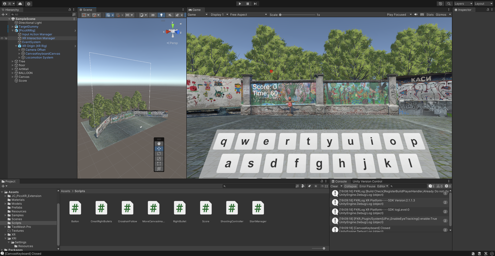

# Pico VR Balloon Shooter

A VR shooting simulation game developed for the Pico VR platform, featuring interactive mechanics, a point system, and high-score tracking.
> **Note:** This repository contains the **core C# scripts** of the project to demonstrate the logic and implementation details. The full Unity project files (Assets, ProjectSettings, etc.) are not included in this repository.

## 🎥 Gameplay Demo
*Due to the current unavailability of the VR hardware, I am unable to perform a full live gameplay demonstration. The recording below showcases the core balloon-rising logic and movement simulation:*
> **https://youtu.be/0G8nSEex32g**
> > *Note: This footage captures the automatic balloon spawn and rise mechanics implemented in the project.*

## 🛠️ Project Overview
This project is a VR shooting game developed in Unity. Players use the right controller to aim at and shoot balloons as they rise. The game includes a dynamic random spawn system, a scoring mechanism with a "Golden Balloon" bonus, and a high-score system that persists across sessions.

## ⚙️ Technical Highlights

### 1. Shooting and Interaction System
* **Raycast Detection**: `ShootingController.cs` handles shooting logic by using `Physics.Raycast` to accurately detect hits on the balloon layer[cite: 7].
* **Crosshair Alignment**: `CrosshairFollow.cs` implements a crosshair that projects onto surfaces using raycasting to enhance aiming precision[cite: 3].
* **UI Interaction**: `MoveCanvasImage.cs` manages the movement of UI elements based on laser input, creating a more immersive interface[cite: 4].

### 2. Game Logic and AI
* **Balloon Behavior**: `Ballon.cs` manages the rising speed and reset logic for balloons[cite: 1]. It includes a 5% chance for a balloon to be "Golden," awarding 100 points compared to the standard 10 points[cite: 1].
* **Scoring and Persistence**: `Score.cs` handles the 60-second countdown and real-time score updates[cite: 6]. It utilizes `PlayerPrefs` to save and retrieve the top 5 high scores[cite: 6].
* **Game Management**: `StartManager.cs` initializes high scores from memory and transitions the player into the main gameplay scene[cite: 8].

## 📦 Core Scripts
| Script | Description |
| :--- | :--- |
| `Ballon.cs` | Controls balloon behavior, random golden balloon logic, and hit detection[cite: 1]. |
| `ShootingController.cs` | Manages controller input (Trigger) and firing raycast logic[cite: 7]. |
| `Score.cs` | Manages game countdown timer and high-score persistence using PlayerPrefs[cite: 6]. |
| `CrosshairFollow.cs` | Projects the crosshair onto targets using raycast layers[cite: 3]. |
| `MoveCanvasImage.cs` | Calculates and updates UI image positions based on ray interactions[cite: 4]. |
| `RightBullet.cs` | Handles bullet movement and orientation[cite: 5]. |
| `CreatRightBullets.cs` | Manages instantiation and cooldowns for shooting[cite: 2]. |
| `StartManager.cs` | Initializes high-score UI and handles scene transitions[cite: 8]. |

## 🚀 Setup & Requirements
* **Unity Version**: 2021.3.44f1
* **Platform**: Pico VR SDK
* **Input**: Right Controller Trigger (Shoot), Primary Button (Start Game)
